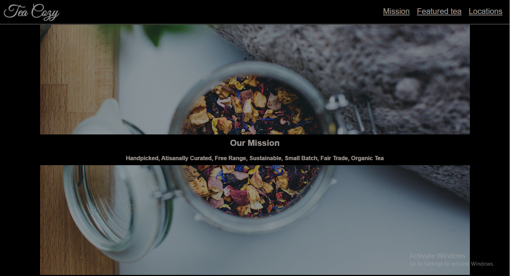
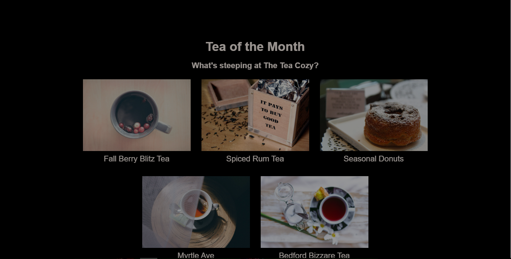
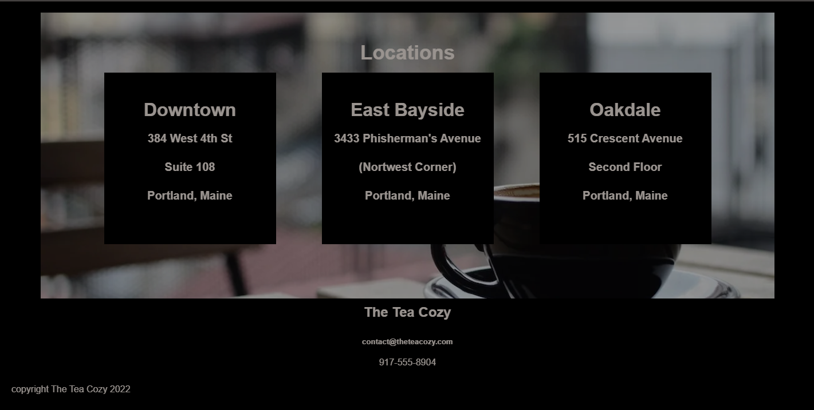

# Tea Cozy (Codecademy Off-platform project)

> Tea Cozy is a tea website that showcase all kinds of tea.This project is an off-platform project from the codecademy full-stack engineering course. 

## Built With

- HTML
- CSS

## Getting Started
- clone the repository by running\
    `git clone git@github.com:Devtiwo/TeaCozy.git`

- navigate to the folder\
    `cd TeaCozy`

## Authors

👤 Taiwo Adetunji

- [GitHub](https://github.com/Devtiwo)
- [Twitter](https://twitter.com/devtiwo)
- [LinkedIn](https://www.linkedin.com/in/taiwo-adetunji-860666225/)

## 🤝 Contributing

Contributions, issues, and feature requests are welcome!

Feel free to check the [issues page](https://github.com/Devtiwo/TeaCozy/issues).

## Show your support

Give a ⭐️ if you like this project!

## Acknowledgement

- Design and inspiration by the Codecademy Team.
- Thanks to the Codecademy team for the design and specifications.
